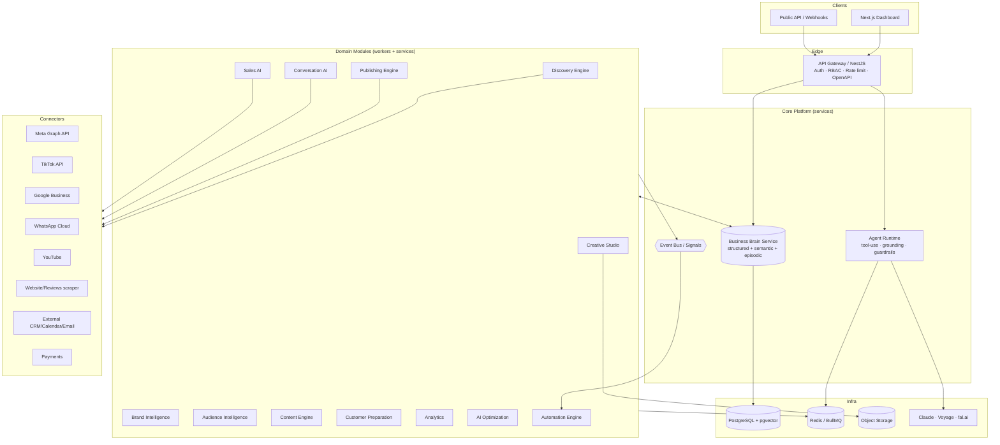

# 01 — System Architecture

## 1. Goals & Constraints

- **One centralized knowledge base** (Business Brain) as the single source of truth.
- **Independent modules connected through shared memory** — modules never call each other's
  internals; they communicate via the Business Brain and an event bus.
- **API-first** — every capability is an API; the web dashboard is just one client.
- **Multi-tenant, secure, auditable** — org isolation, RBAC, full audit trail.
- **Scalable & modular** — stateless services, horizontal workers, queue-backed autonomy.
- **Production-ready** — typed boundaries, tests, observability, migrations, CI/CD.

## 2. High-Level Architecture



**Reading the diagram:** clients hit the gateway; the gateway delegates to the Business Brain
and Agent Runtime; domain modules run as services + queue workers, all reading/writing the
Business Brain and emitting **signals** onto the event bus; the Automation Engine reacts to
signals to drive the autonomous loop; connectors isolate every third-party API.

## 3. Technology Stack

See the table in the [README](../README.md#technology-decisions-assumptions--overridable).
Rationale for the non-obvious picks:

- **NestJS for the API + workers:** the spec demands *modular, RBAC, API-first, easy to
  extend*. Nest's module system, DI, guards, and OpenAPI generation map 1:1 to those needs and
  keep 13 modules from becoming spaghetti.
- **PostgreSQL + pgvector (one store):** the Business Brain needs relational facts *and*
  semantic recall. Keeping both in Postgres avoids a second datastore's operational cost until
  scale demands it (then embeddings can move to a dedicated vector DB behind the same
  interface).
- **Drizzle ORM:** type-safe, generates SQL migrations, and treats `vector` columns as
  first-class — important because Prisma's pgvector support is still awkward.
- **BullMQ:** the autonomous loop is fundamentally asynchronous and retryable (ingestion,
  scheduled posts, follow-ups). Durable queues with backoff/retry are the backbone.

## 4. The Business Brain — Four-Layer Memory

The Brain is the heart of the platform. It has four cooperating layers, all org-scoped:

```
┌─────────────────────────────────────────────────────────────┐
│ 1. STRUCTURED KNOWLEDGE  (facts you can query precisely)      │
│    business profile, products, services, pricing, personas,   │
│    competitors, brand kit, FAQs, policies, offers, sales      │
│    process, testimonials, objections                          │
├─────────────────────────────────────────────────────────────┤
│ 2. SEMANTIC MEMORY  (retrieval by meaning — pgvector)         │
│    every document/post/review/message chunked + embedded,     │
│    with source + permission + freshness metadata → RAG        │
├─────────────────────────────────────────────────────────────┤
│ 3. EPISODIC / SIGNALS  (append-only stream of what happened)  │
│    every post published, comment, DM, lead, appointment,      │
│    sale, review, metric snapshot — timestamped, attributable  │
├─────────────────────────────────────────────────────────────┤
│ 4. DERIVED INTELLIGENCE  (recomputed from 1–3 on a schedule)  │
│    brand voice profile, audience segments, best/worst content │
│    patterns, recommendations — each with a confidence score   │
└─────────────────────────────────────────────────────────────┘
```

**Contract:** modules read via a typed **Business Brain SDK** (`getFacts`, `retrieve(query)`,
`getVoiceProfile`, `getSegments`, …) and write via `recordSignal(event)` /
`upsertKnowledge(...)`. They never touch each other's tables. This is what makes "no module
operates independently" true in code.

**Grounding & citations:** `retrieve()` returns chunks *with* their source rows and confidence.
The Agent Runtime refuses to produce customer-facing output when top-k confidence is below a
per-capability threshold, and it stores the cited chunk IDs on the resulting action for audit.

**Continuous learning:** a nightly (and event-triggered) job recomputes Layer 4 from Layers
1–3, so the Brain "never stops learning" — every interaction shifts future decisions.

## 5. Agent Runtime

A thin, shared orchestration layer every module uses instead of calling Claude directly.

Responsibilities:
- **Model routing** (cost/quality policy, §6).
- **Grounded generation:** inject retrieved Business Brain context + brand voice; enforce
  approved-knowledge-only for customer-facing surfaces.
- **Tool use:** typed tools (`bookAppointment`, `createQuote`, `schedulePost`, `updateCRM`, …)
  with per-tool RBAC + approval gates.
- **Guardrails:** banned topics, PII policy, escalation triggers, value/rate caps, kill switch.
- **Reason-before-act:** produces and logs a rationale + confidence before any consequential
  tool call.
- **Observability:** every run is a traced span with token cost, latency, model, citations.

Agents are declared per module (e.g. `conversation.reply`, `sales.qualify`,
`content.plan-week`) as configs over this runtime — not bespoke integrations.

## 6. Model-Routing Policy

Tiered to match task difficulty (mirrors the project's performance guidance):

| Model | Use for |
|-------|---------|
| **Haiku 4.5** | High-frequency, low-risk: intent classification, comment triage, tagging, sentiment, extraction |
| **Sonnet 5** | Everyday generation: captions, replies, briefings, summaries, routine planning |
| **Opus 4.8** | Deep reasoning: strategy, monthly plans, complex objections, optimization analysis, discovery synthesis |
| **Voyage `voyage-3`** | Embeddings for all semantic memory |
| **fal.ai** | Image/video/creative generation |

Routing is centralized so cost, latency, and quality are tunable in one place, and prompt
caching is applied to the stable Business Brain context.

## 7. Integrations / Connector Layer

Every third-party API sits behind a uniform **Connector** interface
(`connect`, `refreshAuth`, `pull(resource)`, `push(action)`, `subscribeWebhooks`) so modules
depend on capabilities, not vendors.

- **Meta Graph API** — Instagram + Facebook: content publishing, comments, Messenger, insights.
- **TikTok** — Content Posting API + Display API.
- **Google Business Profile** — profile, reviews, posts.
- **WhatsApp Business Cloud API** — conversations.
- **YouTube Data API** — channel/video signals.
- **Website & reviews** — Firecrawl/Playwright scraping for discovery.
- **CRM / Calendar / Email** — pluggable (native CRM first; external via connectors).
- **Payments** — Stripe (payment links, checkout).

OAuth tokens are encrypted at rest (envelope encryption), scoped per org, and auto-refreshed.

## 8. Async & Autonomy (queues + scheduler)

BullMQ queues + a dedicated **scheduler** back every long-running or scheduled behavior.

**Queues** (per-job type):
- `discovery.run` — ingest & analyze a website/social account
- `brain.reindex` — recompute derived intelligence (voice, audience, patterns)
- `analytics.rollup` — daily metrics aggregation + optimization pass
- `automation.signal` — fire matching workflows from episodic signals
- `publish.dispatch` — publish a due, approved scheduled post
- `conversation.inbound` — handle a webhook-delivered DM/comment from Meta/WhatsApp
- `automation.resume` — continue an approval-gated workflow

Workers are horizontally scalable and idempotent; failed jobs retry with backoff and land
in a dead-letter queue with alerting.

**Scheduler** (dedicated BullMQ worker):
Owns three repeatable tickers that fan out real work:
- `daily.tick` (06:00 UTC) → per-org brain reindex + analytics rollup
- `publish.tick` (every minute) → claim & dispatch due, approved scheduled posts
- `workflow.tick` (every minute) → run due schedule-triggered workflows

Recurrence is delegated to BullMQ so ticks survive restarts and never double-fire across
replicas. The scheduler is fundamentally the autonomous clock.

## 9. The Autonomous Signal→Automation Loop

**Closed-loop autonomy** is the core of BrandPilot: signals record what happened, and
workflows react to those signals. This happens automatically via the **signal bridge**:

```
 Module (discovery, content, sales, etc.)
    ↓
 brain.recordSignal(orgId, { type, payload })  [durably stored in `signals` table]
    ↓
 signalSink fire-and-forget hook
    ↓
 producers.automationSignal.add('signal', { orgId, signal })  [enqueue to Redis]
    ↓
 automation.worker (BullMQ consumer)
    ↓
 automationEngine.runWorkflow(orgId, ...)  [fire matching workflows]
    ↓
 action execution (post, DM, update CRM, schedule follow-up, etc.)
```

Every signal — a post published, a lead arrived, a conversation started, a sale closed —
is a potential automation trigger. Workflows are bound by signal type (e.g. `lead_created`)
and optionally by matching conditions on the payload. The bridge ensures no signal is
dropped, even under load, because BullMQ queues are durable and retryable.

## 10. Multi-Tenancy, RBAC & Security

**Isolation (defense-in-depth):**
- Every domain row carries `org_id`.
- **Postgres Row-Level Security** enforces org scoping at the database level via
  `app.org_id` GUC set per-transaction by `withOrgScope` (active on every org-scoped read).
- RLS policies use `nullif(current_setting('app.org_id', true), '')::uuid` so out-of-band
  connections (admin tools) match no rows unless explicitly scoped.

**Roles & Permissions:** `owner`, `admin`, `marketer`, `sales`, `viewer` (extensible),
enforced by NestJS guards mapped to granular permissions (e.g. `content:publish`, `sales:quote`).

**Secrets:** no hardcoded secrets; env vars + secret manager; OAuth tokens envelope-encrypted
(AES-256-GCM keyed on `TOKEN_ENCRYPTION_KEY`).

**Input validation:** Zod schema validation at every system boundary (API, webhooks, model output).

**Inbound webhooks:** Meta & WhatsApp webhooks verified by HMAC-SHA256 over raw body
(`verifyMetaSignature` + `X-Hub-Signature-256` header). GET handshake uses configurable verify token.

**Spend caps:** per-org, per-kind (LLM calls, media renders) daily budgets, Redis-backed
counter stamped with UTC calendar date. `SpendGuard.consume` throws `rate_limited` when
daily cap is exceeded; errors propagate (fail-safe — meter failure does not silently exceed
budget).

**Audit:** append-only `audit_logs` for every consequential action (who/what/when/why/refs).

**Abuse controls:** per-endpoint rate limits (auth routes throttled); per-capability value
caps enforced by SpendGuard; global kill switch via env.

**Privacy:** PII tagging on ingested data; retention & deletion honoring platform ToS.

## 11. Observability & Caching

**Distributed tracing:** OpenTelemetry spans across gateway → runtime → workers, exportable
to any OTLP endpoint (Datadog, Jaeger, etc. via `OTEL_EXPORTER_OTLP_ENDPOINT`).

**Structured logging:** pino with request & org correlation IDs; error tracking via Sentry
(`SENTRY_DSN`). Every agent run is traceable end-to-end with its citations, cost, and model.

**Metrics:** queue depth, model spend per kind (LLM/media/embeddings), job latency per queue.

**Read-through caching:** Redis-backed `Cache` with graceful degradation — cache transport
faults never break the operation. Hot Brain reads (voice profile, brand kit, business
profile) cached at 5-minute TTL.

**Spend metering:** Redis-backed `SpendGuard` with daily counters per (org, kind) stamped
at UTC midnight, auto-expiring after 48h. Errors propagate (fail-safe).

## 12. Reuse / Build-vs-Buy (honoring "research & reuse")

Evaluate forking/wrapping proven OSS before building from scratch (formal GitHub search is a
Phase 0 task):

| Need | Candidate to evaluate | Strategy |
|------|----------------------|----------|
| Scheduling/publishing | **Postiz / Mixpost** | Wrap or port the connector layer |
| Appointments | **Cal.com** | Embed / API integration |
| Conversation inbox | **Chatwoot** | Integrate as the omni-channel inbox backbone |
| CRM | **Twenty** (OSS CRM) | Native-first, but reference its data model |
| Web/review scraping | **Firecrawl** | Use directly |
| Payments | **Stripe** | Use directly |

Anything adopted must sit behind our Connector/SDK interfaces so the Business Brain stays the
source of truth.

## 13. Scalability Notes

Stateless services scale horizontally behind the gateway; workers scale per-queue; Postgres
scales via read replicas + partitioning of the high-volume `signals`/metrics tables; the
vector layer can be extracted to a dedicated vector DB behind the same SDK when embedding
volume demands it.

**Caching strategy:** Redis fronts hot Business Brain reads (voice profile, brand kit,
business profile) at 5-minute TTL. Cache faults degrade gracefully to direct DB read; a
transient Redis outage never breaks the system.

---

**Next:** the concrete tables are in [02 — Database Schema](02-database-schema.md); the
per-module responsibilities and contracts are in [03 — Module Hierarchy](03-module-hierarchy.md).
