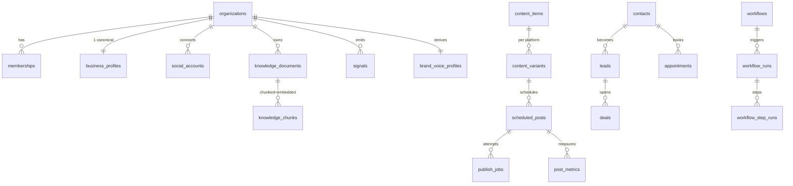

# 02 — Database Schema (PostgreSQL 16 + pgvector)

This is the physical model for the Business Brain and all modules. Presented as annotated SQL
DDL; the implementation uses **Drizzle ORM** and generated migrations. Grouped by domain.

## Conventions

- **PK:** `id uuid primary key default gen_random_uuid()`.
- **Tenancy:** every business row carries `org_id uuid not null references organizations(id)`.
  **Row-Level Security** is enabled on all org-scoped tables (`USING (org_id = current_setting('app.org_id')::uuid)`).
- **Timestamps:** `created_at timestamptz not null default now()`, `updated_at timestamptz not null default now()`.
- **Soft delete:** `deleted_at timestamptz` where retention matters.
- **Flexible fields:** `jsonb` for provider payloads / evolving structures; promoted to columns when queried.
- **Enums:** implemented as Postgres enums or `text` + check; shown as `-- enum(...)`.
- **Money:** `numeric(12,2)` + `currency char(3)`.
- Extensions: `pgcrypto` (gen_random_uuid), `vector` (pgvector).

---

## A. Identity, Tenancy & Governance

```sql
create table organizations (
  id            uuid primary key default gen_random_uuid(),
  name          text not null,
  slug          text unique not null,
  industry      text,
  timezone      text not null default 'UTC',
  locale        text not null default 'en',
  autonomy_mode text not null default 'suggest',  -- enum(observe,suggest,auto_scoped,auto_broad)
  plan          text not null default 'trial',
  settings      jsonb not null default '{}',
  created_at    timestamptz not null default now(),
  updated_at    timestamptz not null default now()
);

create table users (
  id            uuid primary key default gen_random_uuid(),
  email         citext unique not null,
  name          text,
  password_hash text,                 -- null when SSO-only
  auth_provider text,                 -- enum(password,google,...)
  last_login_at timestamptz,
  created_at    timestamptz not null default now()
);

create table memberships (            -- user ↔ org, with role
  id       uuid primary key default gen_random_uuid(),
  org_id   uuid not null references organizations(id) on delete cascade,
  user_id  uuid not null references users(id) on delete cascade,
  role     text not null default 'viewer',  -- enum(owner,admin,marketer,sales,viewer)
  unique (org_id, user_id)
);

create table permissions (            -- optional granular grants beyond role
  id            uuid primary key default gen_random_uuid(),
  membership_id uuid not null references memberships(id) on delete cascade,
  permission    text not null         -- e.g. 'content:publish','sales:quote','conversation:auto_reply'
);

create table api_keys (
  id          uuid primary key default gen_random_uuid(),
  org_id      uuid not null references organizations(id) on delete cascade,
  name        text not null,
  key_hash    text not null,          -- store hash only
  scopes      text[] not null default '{}',
  last_used_at timestamptz,
  revoked_at  timestamptz,
  created_at  timestamptz not null default now()
);

create table audit_logs (             -- append-only; who/what/when/why/refs
  id          uuid primary key default gen_random_uuid(),
  org_id      uuid not null references organizations(id),
  actor_type  text not null,          -- enum(user,agent,system)
  actor_id    text,                   -- user id or agent name
  action      text not null,          -- e.g. 'publish.post','sales.create_quote'
  target_type text,
  target_id   uuid,
  rationale   text,                   -- agent's logged reason-before-act
  confidence  numeric(4,3),
  cited_chunk_ids uuid[],             -- Business Brain grounding refs
  metadata    jsonb not null default '{}',
  created_at  timestamptz not null default now()
);
create index on audit_logs (org_id, created_at desc);
```

---

## B. Connections (Social & Integration Accounts)

```sql
create table social_accounts (
  id             uuid primary key default gen_random_uuid(),
  org_id         uuid not null references organizations(id) on delete cascade,
  provider       text not null,        -- enum(instagram,facebook,tiktok,google_business,whatsapp,youtube,linkedin)
  external_id    text not null,        -- provider account/page id
  handle         text,
  display_name   text,
  scopes         text[] not null default '{}',
  status         text not null default 'connected', -- enum(connected,expired,revoked,error)
  metadata       jsonb not null default '{}',
  connected_at   timestamptz not null default now(),
  unique (org_id, provider, external_id)
);

create table connector_tokens (        -- encrypted OAuth material, separated from account
  id                uuid primary key default gen_random_uuid(),
  social_account_id uuid not null references social_accounts(id) on delete cascade,
  access_token_enc  bytea not null,     -- envelope-encrypted
  refresh_token_enc bytea,
  expires_at        timestamptz,
  updated_at        timestamptz not null default now()
);

create table webhook_subscriptions (
  id                uuid primary key default gen_random_uuid(),
  org_id            uuid not null references organizations(id) on delete cascade,
  provider          text not null,
  topic             text not null,      -- e.g. 'comments','messages','mentions'
  external_sub_id   text,
  active            boolean not null default true,
  created_at        timestamptz not null default now()
);
```

---

## C. Business Brain — Structured Knowledge

```sql
create table business_profiles (       -- one canonical profile per org
  org_id        uuid primary key references organizations(id) on delete cascade,
  legal_name    text,
  description   text,
  mission       text,
  vision        text,
  usp           text,                  -- unique selling proposition
  value_props   jsonb not null default '[]',
  contact       jsonb not null default '{}',  -- phone,email,address,hours
  website_url   text,
  categories    text[] not null default '{}',
  completeness  numeric(4,3) not null default 0,  -- how fully learned (0–1)
  updated_at    timestamptz not null default now()
);

create table products (
  id          uuid primary key default gen_random_uuid(),
  org_id      uuid not null references organizations(id) on delete cascade,
  name        text not null,
  description text,
  price       numeric(12,2),
  currency    char(3),
  sku         text,
  attributes  jsonb not null default '{}',
  active      boolean not null default true,
  source      text,                    -- how learned: enum(discovery,upload,manual)
  updated_at  timestamptz not null default now()
);

create table services (
  id            uuid primary key default gen_random_uuid(),
  org_id        uuid not null references organizations(id) on delete cascade,
  name          text not null,
  description   text,
  duration_min  int,
  price         numeric(12,2),
  currency      char(3),
  bookable      boolean not null default false,
  attributes    jsonb not null default '{}',
  active        boolean not null default true,
  updated_at    timestamptz not null default now()
);

create table pricing_plans (           -- packages / tiers / offers structure
  id          uuid primary key default gen_random_uuid(),
  org_id      uuid not null references organizations(id) on delete cascade,
  name        text not null,
  price       numeric(12,2),
  currency    char(3),
  billing     text,                    -- enum(one_time,monthly,yearly,custom)
  includes    jsonb not null default '[]',
  updated_at  timestamptz not null default now()
);

create table customer_personas (       -- customer avatars
  id            uuid primary key default gen_random_uuid(),
  org_id        uuid not null references organizations(id) on delete cascade,
  name          text not null,
  demographics  jsonb not null default '{}',
  goals         text[] not null default '{}',
  pain_points   text[] not null default '{}',
  buying_triggers text[] not null default '{}',
  objections    text[] not null default '{}',
  channels      text[] not null default '{}',
  confidence    numeric(4,3) not null default 0,
  source        text,                  -- enum(discovery,derived,manual)
  updated_at    timestamptz not null default now()
);

create table competitors (
  id          uuid primary key default gen_random_uuid(),
  org_id      uuid not null references organizations(id) on delete cascade,
  name        text not null,
  handles     jsonb not null default '{}',
  website_url text,
  positioning text,
  strengths   text[] not null default '{}',
  weaknesses  text[] not null default '{}',
  updated_at  timestamptz not null default now()
);

create table brand_kits (
  org_id       uuid primary key references organizations(id) on delete cascade,
  colors       jsonb not null default '[]',   -- [{hex,role}]
  fonts        jsonb not null default '[]',
  logo_asset_id uuid,                          -- → brand_assets
  design_notes text,
  updated_at   timestamptz not null default now()
);

create table brand_assets (            -- logos, image/video library, docs referenced by content
  id          uuid primary key default gen_random_uuid(),
  org_id      uuid not null references organizations(id) on delete cascade,
  kind        text not null,           -- enum(logo,image,video,font,document)
  storage_key text not null,           -- object storage key
  mime        text,
  width       int, height int,
  meta        jsonb not null default '{}',
  created_at  timestamptz not null default now()
);

create table faqs (
  id         uuid primary key default gen_random_uuid(),
  org_id     uuid not null references organizations(id) on delete cascade,
  question   text not null,
  answer     text not null,
  approved   boolean not null default false, -- only approved answers are usable by Conversation AI
  source     text,
  updated_at timestamptz not null default now()
);

create table policies (                -- refund, shipping, privacy, booking policies
  id         uuid primary key default gen_random_uuid(),
  org_id     uuid not null references organizations(id) on delete cascade,
  kind       text not null,
  body       text not null,
  approved   boolean not null default false,
  updated_at timestamptz not null default now()
);

create table offers (
  id          uuid primary key default gen_random_uuid(),
  org_id      uuid not null references organizations(id) on delete cascade,
  name        text not null,
  details     text,
  discount    jsonb,                   -- {type,value}
  starts_at   timestamptz, ends_at timestamptz,
  active      boolean not null default true
);

create table sales_process_stages (
  id          uuid primary key default gen_random_uuid(),
  org_id      uuid not null references organizations(id) on delete cascade,
  position    int not null,
  name        text not null,           -- e.g. discovery→qualify→propose→close
  guidance    text,                    -- how the Sales AI should behave at this stage
  unique (org_id, position)
);

create table testimonials (
  id          uuid primary key default gen_random_uuid(),
  org_id      uuid not null references organizations(id) on delete cascade,
  author      text,
  body        text not null,
  rating      int,
  source      text,                    -- enum(google,meta,upload,...)
  approved    boolean not null default false,
  created_at  timestamptz not null default now()
);

create table objections (              -- known objections + approved rebuttals
  id          uuid primary key default gen_random_uuid(),
  org_id      uuid not null references organizations(id) on delete cascade,
  objection   text not null,
  rebuttal    text,
  approved    boolean not null default false
);

create table onboarding_answers (      -- the ~20 questionnaire answers (gap-fill)
  id          uuid primary key default gen_random_uuid(),
  org_id      uuid not null references organizations(id) on delete cascade,
  question_key text not null,
  answer       jsonb not null,
  created_at   timestamptz not null default now(),
  unique (org_id, question_key)
);
```

---

## D. Business Brain — Semantic Memory (RAG)

```sql
create table knowledge_sources (       -- where knowledge came from
  id          uuid primary key default gen_random_uuid(),
  org_id      uuid not null references organizations(id) on delete cascade,
  kind        text not null,           -- enum(instagram_post,website_page,review,dm,pdf,catalog,...)
  external_ref text,
  permission  text not null default 'public', -- enum(public,granted,restricted)
  fetched_at  timestamptz,
  meta        jsonb not null default '{}'
);

create table knowledge_documents (
  id          uuid primary key default gen_random_uuid(),
  org_id      uuid not null references organizations(id) on delete cascade,
  source_id   uuid references knowledge_sources(id) on delete cascade,
  title       text,
  content     text not null,           -- normalized text
  lang        text,
  hash        text,                    -- dedupe
  created_at  timestamptz not null default now()
);

create table knowledge_chunks (        -- embedded units for retrieval
  id           uuid primary key default gen_random_uuid(),
  org_id       uuid not null references organizations(id) on delete cascade,
  document_id  uuid not null references knowledge_documents(id) on delete cascade,
  chunk_index  int not null,
  content      text not null,
  embedding    vector(1024) not null,  -- voyage-3 dimensionality
  token_count  int,
  metadata     jsonb not null default '{}',  -- {kind,recency,permission,confidence}
  created_at   timestamptz not null default now()
);
-- ANN index for semantic search (per-org filtering applied in query):
create index knowledge_chunks_embedding_idx
  on knowledge_chunks using hnsw (embedding vector_cosine_ops);
create index on knowledge_chunks (org_id);
```

---

## E. Business Brain — Episodic / Signals (append-only)

```sql
create table signals (                 -- the learning stream; partition by month at scale
  id          uuid primary key default gen_random_uuid(),
  org_id      uuid not null references organizations(id) on delete cascade,
  type        text not null,           -- enum(post_published,comment,dm,like,lead_created,
                                        --      appointment_booked,sale,review,metric_snapshot,...)
  subject_type text,                   -- what it's about
  subject_id  uuid,
  payload     jsonb not null default '{}',
  value       numeric,                 -- optional numeric outcome (revenue, count)
  occurred_at timestamptz not null default now()
);
create index on signals (org_id, type, occurred_at desc);
```

---

## F. Business Brain — Derived Intelligence

```sql
create table brand_voice_profiles (    -- Module 2 output; recomputed periodically
  org_id        uuid primary key references organizations(id) on delete cascade,
  personality   jsonb not null default '{}',   -- traits
  tone          jsonb not null default '{}',
  vocabulary    jsonb not null default '{}',   -- preferred/avoid words
  emoji_usage   jsonb not null default '{}',
  sentence_stats jsonb not null default '{}',  -- avg length, rhythm
  do_examples   text[] not null default '{}',
  dont_examples text[] not null default '{}',
  confidence    numeric(4,3) not null default 0,
  computed_at   timestamptz not null default now()
);

create table audience_segments (       -- Module 3 output
  id          uuid primary key default gen_random_uuid(),
  org_id      uuid not null references organizations(id) on delete cascade,
  name        text not null,
  criteria    jsonb not null default '{}',
  size_estimate int,
  interests   text[] not null default '{}',
  sentiment   numeric,
  confidence  numeric(4,3) not null default 0,
  computed_at timestamptz not null default now()
);

create table insights (                -- generic derived findings / recommendations feed
  id          uuid primary key default gen_random_uuid(),
  org_id      uuid not null references organizations(id) on delete cascade,
  module      text not null,           -- which module produced it
  kind        text not null,           -- enum(pattern,recommendation,anomaly,forecast)
  title       text not null,
  body        text,
  evidence    jsonb not null default '{}',  -- signal/chunk refs
  confidence  numeric(4,3) not null default 0,
  status      text not null default 'new', -- enum(new,accepted,dismissed,applied)
  created_at  timestamptz not null default now()
);
```

---

## G. Discovery Engine

```sql
create table discovery_runs (
  id          uuid primary key default gen_random_uuid(),
  org_id      uuid not null references organizations(id) on delete cascade,
  status      text not null default 'queued', -- enum(queued,running,partial,done,failed)
  sources     text[] not null default '{}',
  stats       jsonb not null default '{}',    -- counts per source
  started_at  timestamptz, finished_at timestamptz,
  created_at  timestamptz not null default now()
);

create table ingested_assets (         -- raw pulled posts/media/comments before normalization
  id          uuid primary key default gen_random_uuid(),
  org_id      uuid not null references organizations(id) on delete cascade,
  run_id      uuid references discovery_runs(id) on delete set null,
  provider    text not null,
  kind        text not null,           -- enum(post,reel,story,image,video,comment,review,page)
  external_id text,
  raw         jsonb not null default '{}',
  storage_key text,                    -- media copied to object storage
  metrics     jsonb not null default '{}',
  captured_at timestamptz,
  unique (org_id, provider, kind, external_id)
);
```

---

## H. Content Engine

```sql
create table content_plans (           -- monthly/weekly strategy
  id          uuid primary key default gen_random_uuid(),
  org_id      uuid not null references organizations(id) on delete cascade,
  period      daterange not null,
  strategy    jsonb not null default '{}',  -- pillars, cadence, goals
  status      text not null default 'draft', -- enum(draft,approved,active,archived)
  created_by  text,                    -- user id or agent
  created_at  timestamptz not null default now()
);

create table content_items (           -- a single planned piece
  id          uuid primary key default gen_random_uuid(),
  org_id      uuid not null references organizations(id) on delete cascade,
  plan_id     uuid references content_plans(id) on delete set null,
  pillar      text,
  format      text not null,           -- enum(post,carousel,story,reel,article,email,gbp_post)
  brief       text,                    -- hook/angle/CTA idea
  status      text not null default 'idea', -- enum(idea,drafted,approved,scheduled,published,rejected)
  scheduled_for timestamptz,
  created_at  timestamptz not null default now()
);

create table content_variants (        -- per-platform rendered copy
  id            uuid primary key default gen_random_uuid(),
  org_id        uuid not null references organizations(id) on delete cascade,
  content_item_id uuid not null references content_items(id) on delete cascade,
  platform      text not null,         -- enum(instagram,facebook,tiktok,linkedin,pinterest,gbp,email,blog)
  caption       text,
  hook          text,
  cta           text,
  hashtags      text[] not null default '{}',
  asset_ids     uuid[] not null default '{}', -- → creative_assets
  voice_score   numeric(4,3),          -- brand-voice conformance
  created_at    timestamptz not null default now()
);

create table content_approvals (       -- human-in-the-loop gate
  id            uuid primary key default gen_random_uuid(),
  org_id        uuid not null references organizations(id) on delete cascade,
  content_item_id uuid not null references content_items(id) on delete cascade,
  decided_by    uuid references users(id),
  decision      text not null default 'pending', -- enum(pending,approved,changes,rejected)
  notes         text,
  decided_at    timestamptz
);
```

---

## I. Creative Studio

```sql
create table creative_jobs (
  id          uuid primary key default gen_random_uuid(),
  org_id      uuid not null references organizations(id) on delete cascade,
  content_item_id uuid references content_items(id) on delete set null,
  kind        text not null,           -- enum(image,carousel,story,cover,thumbnail,video,ad)
  prompt      jsonb not null default '{}',
  provider    text not null default 'fal',
  status      text not null default 'queued', -- enum(queued,rendering,done,failed)
  created_at  timestamptz not null default now()
);

create table creative_assets (
  id          uuid primary key default gen_random_uuid(),
  org_id      uuid not null references organizations(id) on delete cascade,
  job_id      uuid references creative_jobs(id) on delete set null,
  storage_key text not null,
  mime        text, width int, height int, duration_ms int,
  brand_check numeric(4,3),            -- adherence to brand kit
  meta        jsonb not null default '{}',
  created_at  timestamptz not null default now()
);
```

---

## J. Publishing Engine

```sql
create table scheduled_posts (
  id            uuid primary key default gen_random_uuid(),
  org_id        uuid not null references organizations(id) on delete cascade,
  content_variant_id uuid not null references content_variants(id) on delete cascade,
  social_account_id uuid not null references social_accounts(id),
  scheduled_for timestamptz not null,
  status        text not null default 'scheduled', -- enum(scheduled,publishing,published,failed,paused,canceled)
  approval_required boolean not null default true,
  approved_at   timestamptz,
  created_at    timestamptz not null default now()
);
create index on scheduled_posts (org_id, scheduled_for);

create table publish_jobs (            -- attempts + provider results (retryable)
  id            uuid primary key default gen_random_uuid(),
  org_id        uuid not null references organizations(id) on delete cascade,
  scheduled_post_id uuid not null references scheduled_posts(id) on delete cascade,
  attempt       int not null default 1,
  status        text not null,         -- enum(pending,success,error)
  external_post_id text,
  error         jsonb,
  ran_at        timestamptz not null default now()
);
```

---

## K. Conversation AI

```sql
create table conversations (
  id            uuid primary key default gen_random_uuid(),
  org_id        uuid not null references organizations(id) on delete cascade,
  channel       text not null,         -- enum(ig_comment,ig_dm,fb_comment,messenger,whatsapp)
  external_thread_id text,
  contact_id    uuid,                  -- → contacts (nullable until identified)
  status        text not null default 'open', -- enum(open,ai_handling,needs_human,closed)
  intent        text,                  -- classified
  sentiment     numeric,
  assigned_to   uuid references users(id),
  last_message_at timestamptz,
  created_at    timestamptz not null default now()
);
create index on conversations (org_id, status, last_message_at desc);

create table conversation_messages (
  id            uuid primary key default gen_random_uuid(),
  org_id        uuid not null references organizations(id) on delete cascade,
  conversation_id uuid not null references conversations(id) on delete cascade,
  direction     text not null,         -- enum(inbound,outbound)
  author_type   text not null,         -- enum(customer,agent,human)
  body          text,
  attachments   jsonb not null default '[]',
  grounding     jsonb,                 -- cited chunks + confidence (outbound only)
  external_id   text,
  created_at    timestamptz not null default now()
);
```

---

## L. CRM & Leads

```sql
create table contacts (
  id          uuid primary key default gen_random_uuid(),
  org_id      uuid not null references organizations(id) on delete cascade,
  name        text,
  email       citext, phone text,
  handles     jsonb not null default '{}',  -- {instagram,tiktok,...}
  tags        text[] not null default '{}',
  attributes  jsonb not null default '{}',
  created_at  timestamptz not null default now()
);
create index on contacts (org_id, email);

create table pipeline_stages (
  id       uuid primary key default gen_random_uuid(),
  org_id   uuid not null references organizations(id) on delete cascade,
  position int not null,
  name     text not null,
  unique (org_id, position)
);

create table leads (
  id          uuid primary key default gen_random_uuid(),
  org_id      uuid not null references organizations(id) on delete cascade,
  contact_id  uuid references contacts(id) on delete set null,
  source      text,                    -- enum(comment,dm,form,discovery,manual)
  score       numeric(4,3),            -- qualification score
  status      text not null default 'new', -- enum(new,qualified,unqualified,nurturing,converted,lost)
  stage_id    uuid references pipeline_stages(id),
  intent_estimate numeric(4,3),
  owner_id    uuid references users(id),
  created_at  timestamptz not null default now()
);

create table lead_activities (
  id          uuid primary key default gen_random_uuid(),
  org_id      uuid not null references organizations(id) on delete cascade,
  lead_id     uuid not null references leads(id) on delete cascade,
  kind        text not null,           -- enum(note,status_change,message,meeting,followup)
  body        text,
  actor_type  text,                    -- user/agent
  created_at  timestamptz not null default now()
);

create table deals (
  id          uuid primary key default gen_random_uuid(),
  org_id      uuid not null references organizations(id) on delete cascade,
  lead_id     uuid references leads(id) on delete set null,
  title       text,
  amount      numeric(12,2), currency char(3),
  stage_id    uuid references pipeline_stages(id),
  status      text not null default 'open', -- enum(open,won,lost)
  closed_at   timestamptz,
  created_at  timestamptz not null default now()
);
```

---

## M. Appointments

```sql
create table availability_slots (
  id          uuid primary key default gen_random_uuid(),
  org_id      uuid not null references organizations(id) on delete cascade,
  user_id     uuid references users(id),  -- consultant, nullable for org-level
  starts_at   timestamptz not null, ends_at timestamptz not null,
  is_booked   boolean not null default false
);

create table appointments (
  id          uuid primary key default gen_random_uuid(),
  org_id      uuid not null references organizations(id) on delete cascade,
  contact_id  uuid references contacts(id),
  lead_id     uuid references leads(id),
  service_id  uuid references services(id),
  slot_id     uuid references availability_slots(id),
  starts_at   timestamptz not null, ends_at timestamptz,
  status      text not null default 'booked', -- enum(booked,confirmed,completed,no_show,canceled)
  location    text,                    -- physical / video link
  external_ref text,                   -- calendar event id
  created_at  timestamptz not null default now()
);
```

---

## N. Sales (Proposals, Quotes, Payments)

```sql
create table proposals (
  id          uuid primary key default gen_random_uuid(),
  org_id      uuid not null references organizations(id) on delete cascade,
  contact_id  uuid references contacts(id),
  deal_id     uuid references deals(id),
  body        jsonb not null default '{}',  -- generated sections
  status      text not null default 'draft', -- enum(draft,sent,accepted,rejected)
  created_at  timestamptz not null default now()
);

create table quotes (
  id          uuid primary key default gen_random_uuid(),
  org_id      uuid not null references organizations(id) on delete cascade,
  proposal_id uuid references proposals(id) on delete set null,
  line_items  jsonb not null default '[]',
  subtotal    numeric(12,2), total numeric(12,2), currency char(3),
  valid_until timestamptz,
  status      text not null default 'draft', -- enum(draft,sent,accepted,expired)
  created_at  timestamptz not null default now()
);

create table payment_links (
  id          uuid primary key default gen_random_uuid(),
  org_id      uuid not null references organizations(id) on delete cascade,
  quote_id    uuid references quotes(id) on delete set null,
  provider    text not null default 'stripe',
  external_id text,
  url         text,
  amount      numeric(12,2), currency char(3),
  status      text not null default 'created', -- enum(created,paid,expired,canceled)
  created_at  timestamptz not null default now()
);
```

---

## O. Analytics

```sql
create table post_metrics (            -- per published post, time-series snapshots
  id            uuid primary key default gen_random_uuid(),
  org_id        uuid not null references organizations(id) on delete cascade,
  scheduled_post_id uuid references scheduled_posts(id) on delete set null,
  external_post_id text,
  platform      text not null,
  captured_at   timestamptz not null default now(),
  reach int, impressions int, likes int, comments int, shares int, saves int,
  clicks int, video_views int,
  raw           jsonb not null default '{}'
);
create index on post_metrics (org_id, platform, captured_at desc);

create table kpi_daily (               -- rolled-up daily KPIs per org
  org_id      uuid not null references organizations(id) on delete cascade,
  day         date not null,
  reach int, impressions int, engagement int, ctr numeric,
  leads int, appointments int, sales int,
  revenue numeric(12,2), conversion_rate numeric,
  cac numeric, roas numeric, ltv numeric, followers int,
  primary key (org_id, day)
);
```

---

## P. AI Optimization

```sql
create table experiments (             -- A/B and pattern tests
  id          uuid primary key default gen_random_uuid(),
  org_id      uuid not null references organizations(id) on delete cascade,
  hypothesis  text not null,
  variable    text,                    -- e.g. hook,cta,post_time,format
  variants    jsonb not null default '[]',
  status      text not null default 'running', -- enum(running,concluded,aborted)
  result      jsonb,
  confidence  numeric(4,3),
  created_at  timestamptz not null default now()
);
-- recommendations reuse `insights` (kind='recommendation') with status lifecycle.
```

---

## Q. Automation Engine

```sql
create table workflows (
  id          uuid primary key default gen_random_uuid(),
  org_id      uuid not null references organizations(id) on delete cascade,
  name        text not null,
  trigger     jsonb not null,          -- {type:'signal', match:{type:'comment'}} | {type:'schedule',cron}
  definition  jsonb not null,          -- ordered steps (DAG) with guardrails & approval flags
  enabled     boolean not null default true,
  created_at  timestamptz not null default now()
);

create table workflow_runs (
  id          uuid primary key default gen_random_uuid(),
  org_id      uuid not null references organizations(id) on delete cascade,
  workflow_id uuid not null references workflows(id) on delete cascade,
  trigger_signal_id uuid references signals(id),
  status      text not null default 'running', -- enum(running,waiting_approval,done,failed,canceled)
  context     jsonb not null default '{}',
  started_at  timestamptz not null default now(), finished_at timestamptz
);

create table workflow_step_runs (
  id          uuid primary key default gen_random_uuid(),
  org_id      uuid not null references organizations(id) on delete cascade,
  run_id      uuid not null references workflow_runs(id) on delete cascade,
  step_key    text not null,
  status      text not null,           -- enum(pending,running,success,skipped,error,awaiting_approval)
  input       jsonb, output jsonb, error jsonb,
  ran_at      timestamptz not null default now()
);
```

---

## R. Approvals & Owner Tasks (dashboard)

```sql
create table approvals (               -- generic approval queue surfaced on the dashboard
  id          uuid primary key default gen_random_uuid(),
  org_id      uuid not null references organizations(id) on delete cascade,
  kind        text not null,           -- enum(content,publish,quote,payment,reply,workflow)
  target_type text not null, target_id uuid not null,
  requested_by text,                   -- agent/user
  summary     text,
  confidence  numeric(4,3),
  status      text not null default 'pending', -- enum(pending,approved,rejected,expired)
  decided_by  uuid references users(id), decided_at timestamptz,
  created_at  timestamptz not null default now()
);
create index on approvals (org_id, status, created_at desc);

create table owner_tasks (             -- "what needs your attention" (<15 min/week)
  id          uuid primary key default gen_random_uuid(),
  org_id      uuid not null references organizations(id) on delete cascade,
  title       text not null,
  detail      text,
  priority    text not null default 'normal', -- enum(low,normal,high)
  due_at      timestamptz,
  status      text not null default 'open', -- enum(open,done,dismissed)
  created_at  timestamptz not null default now()
);
```

---

## Relationships at a glance



**Design note:** structured tables answer *precise* questions; `knowledge_chunks` answers
*fuzzy* ones; `signals` records *what happened*; the derived tables are *recomputed* from all
three. That separation is what lets every module share one brain without stepping on each other.
