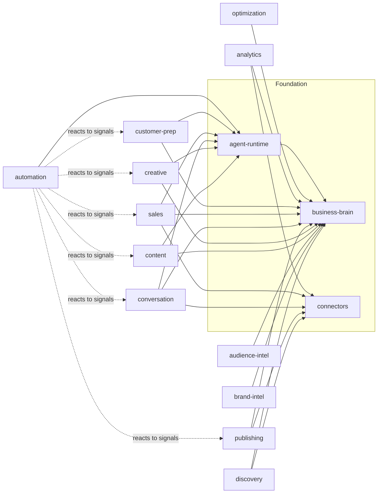

# 03 — Module Hierarchy

Every module is an independent package that talks to the **Business Brain** and emits
**signals**. Modules never import each other's internals; cross-module choreography happens in
the **Automation Engine** reacting to signals.

## Monorepo Layout

```
brandpilot/
├─ apps/
│  ├─ web/                      # Next.js 16 dashboard (client of the API)
│  ├─ api/                      # NestJS HTTP API + OpenAPI (the "front door")
│  └─ worker/                   # BullMQ workers running the autonomous jobs
├─ packages/
│  ├─ core/                     # shared types, Zod schemas, errors, RBAC, event contracts
│  ├─ db/                       # Drizzle schema + migrations (from doc 02)
│  ├─ config/                   # env loading, constants, model policy
│  ├─ business-brain/           # ← the source of truth SDK (4 memory layers)
│  ├─ agent-runtime/            # model routing, grounding, guardrails, typed tools
│  ├─ connectors/               # Meta, TikTok, Google, WhatsApp, YouTube, scraper, Stripe
│  ├─ ui/                       # shared shadcn/ui components
│  └─ modules/
│     ├─ discovery/             # Module 2  (the onboarding wedge)
│     ├─ brand-intelligence/    # Module 2b
│     ├─ audience-intelligence/ # Module 3
│     ├─ content-engine/        # Module 4
│     ├─ creative-studio/       # Module 5
│     ├─ publishing/            # Module 6
│     ├─ conversation/          # Module 7
│     ├─ sales/                 # Module 8
│     ├─ customer-prep/         # Module 9
│     ├─ analytics/             # Module 10
│     ├─ optimization/          # Module 11
│     └─ automation/            # Module 12
└─ docs/
```

> **File-size discipline** (per coding standards): modules are split into focused files
> (services, agents, schemas, jobs) — target 200–400 lines, 800 max.

## Foundational packages

### `business-brain` — the shared memory SDK
The only package allowed to read/write Brain tables. Public API (typed, Zod-validated):
- `facts.*` — CRUD over structured knowledge (profile, products, services, personas, …).
- `retrieve(orgId, query, opts)` → chunks + sources + confidence (semantic RAG).
- `upsertKnowledge(orgId, doc)` — chunk + embed + store (Voyage).
- `recordSignal(orgId, signal)` — append to episodic stream.
- `derived.getVoiceProfile / getSegments / getInsights`.
- `recomputeDerived(orgId)` — regenerate Layer 4.

### `agent-runtime` — grounded, guardrailed AI
- `run(agentName, input)` — routes model (Haiku/Sonnet/Opus), injects Brain context + voice,
  enforces approved-knowledge-only, produces reason-before-act rationale + confidence, executes
  typed tools with per-tool RBAC/approval, emits a traced, audited record.
- Tool registry: `schedulePost`, `sendMessage`, `bookAppointment`, `createQuote`,
  `createPaymentLink`, `updateCRM`, `escalateToHuman`, … each gated.

### `connectors` — vendor isolation
Uniform interface `{ connect, refreshAuth, pull, push, subscribeWebhooks }` per provider.
Modules depend on capabilities, never on a vendor SDK directly.

---

## The 13 Domain Modules (contracts)

Legend — **Reads**: what it pulls from the Brain. **Writes**: signals/knowledge it emits.
**Gate**: default approval requirement.

### Module 1 — Business Brain *(the `business-brain` package above)*
The core; not a "domain module" but the substrate all others use. Owns the four memory layers,
grounding, citations, and continuous learning (`recomputeDerived`).

### Module 2 — Discovery Engine  `modules/discovery`
- **Responsibility:** after accounts connect, scan every permitted source (posts, media,
  captions, comments, DMs, audience, website, reviews, GBP, uploads, catalog, logo/colors/fonts,
  competitors, trends) and build the initial **Business DNA**.
- **Reads:** connections, onboarding answers. **Writes:** `ingested_assets`, `knowledge_*`,
  seeds `business_profiles/products/services/personas/competitors`, `signals`. (Brand-kit
  extraction — colors/fonts/logo → `brand_kits`, consumed by Creative Studio — is **not yet
  wired**; it needs website computed-styles or a vision pass. Tracked in docs/07.)
- **Models:** Opus (synthesis) + Haiku (bulk extraction/classification) + Voyage (embeddings).
- **Integrations:** all social connectors + Firecrawl. **Gate:** none (observe-only).

### Module 2b — Brand Intelligence  `modules/brand-intelligence`
- **Responsibility:** derive brand personality, tone, vocabulary, emoji usage, sentence style,
  visual identity, content pillars, best/worst-performing patterns, topics to embrace/avoid.
- **Reads:** `knowledge_*`, `signals`, `post_metrics`. **Writes:** `brand_voice_profiles`,
  `insights`. **Models:** Opus. **Gate:** none (derives; owner can edit the profile).

### Module 3 — Audience Intelligence  `modules/audience-intelligence`
- **Responsibility:** build personas & segments from followers, engagement, comments, DMs;
  extract pain points, buying triggers, objections, language, demographics, sentiment.
- **Reads:** `ingested_assets`, `conversation_messages`, `signals`. **Writes:**
  `customer_personas`, `audience_segments`, `objections`, `insights`. **Models:** Opus + Haiku.

### Module 4 — Content Engine  `modules/content-engine`
- **Responsibility:** strategy → monthly calendar → weekly plan → per-platform posts,
  carousels, stories, reels, captions, hooks, CTAs, hashtags, SEO, email, blog — all in brand
  voice, passing the voice-conformance check.
- **Reads:** voice profile, segments, pillars, offers, products/services. **Writes:**
  `content_plans`, `content_items`, `content_variants`, `signals`. **Models:** Sonnet
  (generation) + Opus (strategy). **Gate:** content approval.

### Module 5 — Creative Studio  `modules/creative-studio`
- **Responsibility:** generate images, carousels, story designs, covers, reel storyboards,
  video scripts, thumbnails, mockups, ads — all following the brand kit.
- **Reads:** `brand_kits`, `content_items`. **Writes:** `creative_jobs`, `creative_assets`.
- **Integrations:** fal.ai. **Models:** Sonnet (prompts/scripts) + fal. **Gate:** content approval.

### Module 6 — Publishing Engine  `modules/publishing`
- **Responsibility:** schedule, optimize posting time, feed preview, visual consistency, cross-
  publish, pause campaigns, retry failures, track published assets.
- **Reads:** `content_variants`, `creative_assets`, `kpi_daily` (best times). **Writes:**
  `scheduled_posts`, `publish_jobs`, `signals(post_published)`. **Integrations:** Meta, TikTok,
  GBP. **Gate:** publish approval (promotable to Auto with caps).

### Module 7 — Conversation AI  `modules/conversation`
- **Responsibility:** monitor comments/DMs/Messenger/WhatsApp; reply, ask qualifying questions,
  handle objections, collect info, book meetings, escalate — **approved knowledge only**.
- **Reads:** `retrieve()`, FAQs, policies, objections, voice profile. **Writes:**
  `conversations`, `conversation_messages`, `contacts`, `signals`. **Integrations:** Meta,
  WhatsApp. **Models:** Haiku (triage) + Sonnet (reply). **Gate:** reply approval → Auto for
  FAQ intents.

### Module 8 — Sales AI  `modules/sales`
- **Responsibility:** recommend services, present packages, explain pricing, up/cross-sell,
  generate proposals/quotes, create payment links, book appointments, update CRM; escalate when
  needed.
- **Reads:** products/services/pricing/offers, sales stages, lead history. **Writes:** `leads`,
  `deals`, `proposals`, `quotes`, `payment_links`, `lead_activities`, `signals(sale)`.
  **Integrations:** Stripe, calendar. **Models:** Opus (complex) + Sonnet. **Gate:** quote &
  payment approval (value caps).

### Module 9 — Customer Preparation  `modules/customer-prep`
- **Responsibility:** before each consultation, research public info, summarize the customer &
  their business, interests, prior interactions, marketing history, intent estimate → a
  one-page briefing for the consultant.
- **Reads:** `contacts`, `conversations`, `signals`, `retrieve()`, public web. **Writes:**
  briefing doc (`insights`/asset), `owner_tasks`. **Models:** Opus. **Gate:** none (internal).

### Module 10 — Analytics  `modules/analytics`
- **Responsibility:** collect metrics (reach, impressions, engagement, CTR, leads,
  appointments, sales, revenue, conversion, CAC, ROAS, LTV, retention, growth, top/worst posts,
  trends) and roll up daily KPIs.
- **Reads:** connectors' insights APIs, `signals`. **Writes:** `post_metrics`, `kpi_daily`,
  `signals(metric_snapshot)`. **Integrations:** Meta/TikTok/GBP insights. **Gate:** none.

### Module 11 — AI Optimization  `modules/optimization`
- **Responsibility:** analyze what works/fails — best hooks, CTAs, image styles, reel duration,
  hashtags, posting times, engagement windows — run experiments, and suggest improvements with
  confidence scores that feed back into Content/Publishing.
- **Reads:** `post_metrics`, `kpi_daily`, `signals`. **Writes:** `experiments`, `insights`
  (recommendations), updates to derived intelligence. **Models:** Opus. **Gate:** recommendation
  requires acceptance (or Auto-apply for low-risk knobs).

### Module 12 — Automation Engine  `modules/automation`
- **Responsibility:** the choreography layer. Subscribes to signals, runs workflows (the
  autonomous loop from doc 00), enforces guardrails/approvals, retries, and updates the Brain.
- **Reads:** `workflows`, `signals`. **Writes:** `workflow_runs`, `workflow_step_runs`,
  `approvals`, `owner_tasks`. **Depends on:** every module via the Agent Runtime tool registry.
  **Gate:** per-step (inherits each action's gate).

### Module 13 — Business Dashboard  `apps/web`
- **Responsibility:** the owner's <15-min/week surface — daily summary, tasks completed, posts
  published, leads, appointments, revenue, pipeline, pending approvals, AI recommendations, and
  the marketing / sales / growth scores.
- **Reads:** everything via the API (read models). **Writes:** approvals/decisions, settings,
  autonomy toggles.

---

## Cross-cutting concerns (in `core` / `api`)

- **Auth & RBAC** — JWT sessions (argon2 + Passport / `@nestjs/jwt`), org context, NestJS fail-closed global guards, Postgres RLS.
- **Event bus / signals** — typed contracts in `core`; the spine of module decoupling.
- **Audit & observability** — every consequential action → `audit_logs` + OTel span.
- **Approvals** — generic queue surfaced on the dashboard, powering the trust model.

## Dependency graph



Everything points at the Business Brain. The Automation Engine is the only module that
coordinates others — and it does so through the Agent Runtime's gated tools, never by reaching
into another module. That is the structural guarantee behind "no module operates independently."
